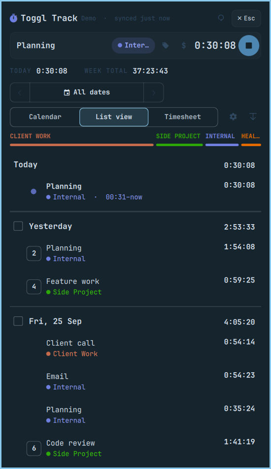
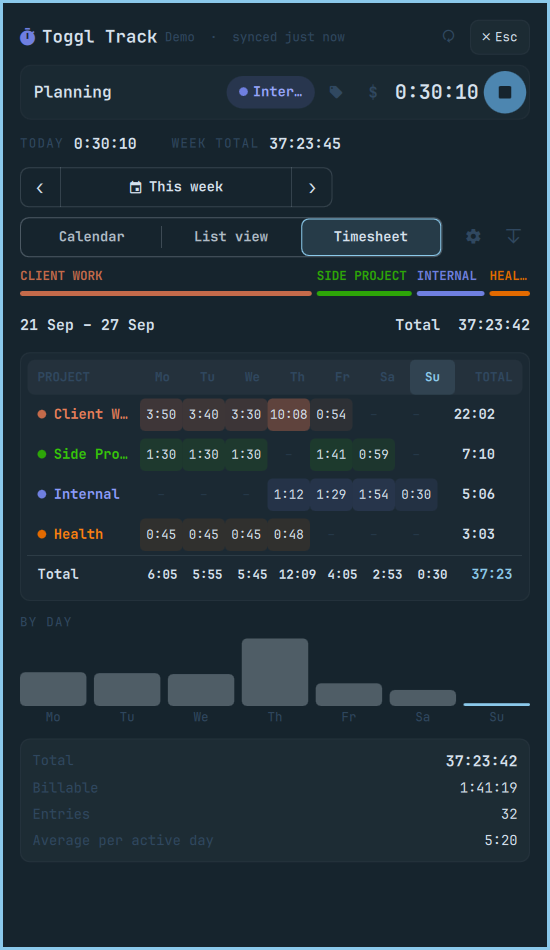
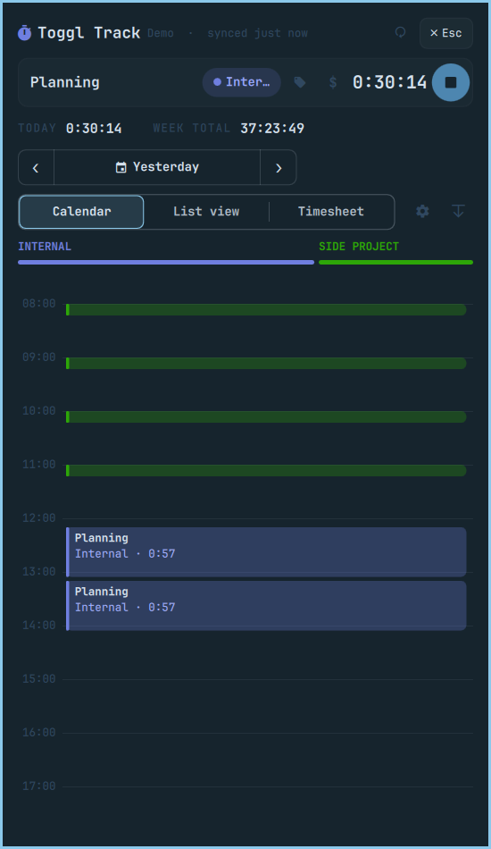

# Omarchy Toggl

A [Toggl Track](https://toggl.com/track/) timer for the [Omarchy](https://omarchy.org/) bar.

The bar pill shows the running entry (`● Research 0:30:05`), or today's total when
nothing is running. Clicking it opens a keyboard-driven panel laid out like the
Toggl web app:

- a timer bar for quick start and editing
- TODAY and WEEK TOTAL figures
- a date navigator
- Calendar, List view and Timesheet views
- a per-project legend
- entries grouped by day, with similar entries collapsed

<p align="center">
  
  
  
</p>

> This is an unofficial community plugin. It is not affiliated with or endorsed by Toggl.

## Features

- **Timer bar.** Type what you're working on, using `@project #tag $` for project,
  tags and billable. It suggests previous entries as you type. While a timer runs
  you can rename it inline, change its project, tags or billable flag, or backdate
  its start (`14:02`, `-15m`, `yesterday 17:30`).
- **List view.** Day groups with totals and checkboxes for bulk delete. Similar
  entries collapse behind a count badge. Hover actions are continue and a ⋮ menu
  (edit, duplicate, copy, delete).
- **Timesheet.** A project × weekday grid with totals, per-day bars and a billable summary.
- **Calendar.** A day timeline in project colours with a live "now" line. Click a
  block to edit it, or click an empty slot to add an entry.
- **Idle detection.** After you've been idle or suspended, the panel asks whether
  to keep the time, discard it, or discard it and stop.
- **Theme-aware.** It uses the Omarchy shell's colours, fonts and spacing, and
  switches with `omarchy theme set`.
- **Works offline.** Edits made while offline are queued and replayed on the next sync.

## Requirements and dependencies

- Omarchy with the Quickshell-based `omarchy-shell` bar (the version that has `omarchy plugin`).
- `python3`, standard library only. There are no pip packages.
- Optional: `secret-tool` (libsecret) and a running Secret Service keyring such
  as gnome-keyring. Without it, the token is stored in a mode 0600 file.
- Optional, for `scripts/install-local.sh`: `rsync` and `jq`.
- Optional, for development: `deno`, which runs the `Model.js` tests.

The only network service used is `api.track.toggl.com`.

The plugin ID is `io.github.eatemall.toggl`.

## Install

With Omarchy's plugin manager:

```bash
omarchy plugin add https://github.com/EatEmAll/omarchy-toggl.git --enable
```

Omarchy shows its unsandboxed-code warning and asks you to confirm. It then
clones the plugin to `~/.config/omarchy/plugins/io.github.eatemall.toggl` and adds the widget
to the bar. To move the widget:

```bash
omarchy bar move io.github.eatemall.toggl --section right
```

To also get the `omarchy-toggl` terminal command (optional; the widget does not need it):

```bash
install -Dm755 ~/.config/omarchy/plugins/io.github.eatemall.toggl/scripts/omarchy-toggl ~/.local/bin/omarchy-toggl
```

Or install from a clone:

```bash
git clone https://github.com/EatEmAll/omarchy-toggl.git
cd omarchy-toggl
./scripts/install-local.sh            # add --no-enable to place the widget yourself
```

`install-local.sh` does the following:
- copies the plugin into the Omarchy plugin folder. It only writes into a folder it created itself, recorded in a `.omarchy-toggl-install` marker. When updating, it deletes only files listed in that marker, and it refuses to touch any other existing folder;
- installs the `omarchy-toggl` command, unless a different file with that name already exists;
- enables the widget with `omarchy plugin enable`, which is its only change to `shell.json`.

Nothing else in your configuration is touched. Keybindings and menu entries are
opt-in snippets, described below.

Update with `omarchy plugin update io.github.eatemall.toggl`, or with `git pull &&
./scripts/install-local.sh` for a clone.

## Uninstall

```bash
# Optional, and before removing: delete the stored API token and cache.
# Without the CLI, run python3 ~/.config/omarchy/plugins/io.github.eatemall.toggl/src/toggl.py auth logout
omarchy-toggl auth logout
omarchy plugin remove io.github.eatemall.toggl
rm -f ~/.local/bin/omarchy-toggl               # if you installed the CLI
rm -rf ~/.cache/omarchy-toggl                  # cached entries, if you skipped logout
```

From a clone, `./scripts/uninstall.sh --purge` does all of the above. It only
reminds you about keybindings or menu entries you added by hand.

## Sign in

Open the panel. It shows Settings while you're signed out. Paste your API token
from <https://track.toggl.com/profile>, or sign in from a terminal:

```bash
omarchy-toggl auth login
```

## Usage

| Where | Action |
|---|---|
| Pill | left click: panel · middle click: stop / continue last · right click: while a timer runs, cycle the timer (0:30:05 → 0:30 → hidden); otherwise a today/week notification |
| Panel | see the keys below |
| CLI / IPC | see below; handy for keybindings and the Omarchy menu |

**Panel keys**

| Key | Action |
|---|---|
| `n` or `/` | new entry |
| `s` | stop |
| `space` | stop / continue |
| `1` `2` `3` | Calendar / List / Timesheet |
| `,` | settings |
| `[` `]` | step the date range |
| `t` / `a` | today / all dates |
| `f` | search |
| `j` / `k` | move |
| `h` / `l` | fold / unfold groups |
| `↵` | continue |
| `e` | edit |
| `x` | delete |
| `m` | row menu |
| `v` | select |
| `r` | sync |
| `c` | compact |
| `Esc` | back / close |

### Optional keybindings

Add these to `~/.config/hypr/bindings.lua`, adjusting the keys to taste:

```lua
o.bind("SUPER + ALT + T", "Toggl panel", "omarchy-shell shell toggle io.github.eatemall.toggl")
o.bind("SUPER + ALT + SHIFT + T", "Toggl start/stop", "omarchy-shell omarchy-toggl toggle")
```

### Optional Omarchy menu entries

Add these to `~/.config/omarchy/extensions/omarchy-menu.jsonc`:

```jsonc
"toggl": {"icon":"󱎫","label":"Toggl"},
"toggl.quick": {"icon":"","label":"Start…","action":"omarchy-shell omarchy-toggl quick"},
"toggl.toggle": {"icon":"","label":"Stop / continue","action":"omarchy-shell omarchy-toggl toggle"},
"toggl.panel": {"icon":"󰄧","label":"Open panel","action":"omarchy-shell shell toggle io.github.eatemall.toggl"},
"toggl.timesheet": {"icon":"󰃭","label":"Timesheet","action":"omarchy-shell omarchy-toggl openView timesheet"},
```

## CLI

```
omarchy-toggl status [--text]          # cached state; never calls the API
omarchy-toggl start Research @stonks   # also: --project ID --tag T --billable --at 14:02
omarchy-toggl stop | toggle | continue [ID]
omarchy-toggl add --start 9:00 --stop 9:30 Meeting @Generic
omarchy-toggl update ID --description x --project none --tags a,b --start -15m
omarchy-toggl delete ID...
omarchy-toggl sync --force [--meta]
omarchy-toggl auth login | status | logout
omarchy-toggl doctor
```

Every command prints one JSON line (`--text` prints a readable line instead).
The exit codes are:

| Code | Meaning |
|---|---|
| 0 | ok |
| 2 | usage error |
| 3 | authentication error |
| 4 | quota exhausted |
| 5 | network error |

The shell also exposes an IPC target named `omarchy-toggl`:

```
omarchy-shell omarchy-toggl <toggle | start TEXT | stop | continueLast | quick | openView list|timesheet|calendar|settings | sync | status>
```

## Settings

Change settings in the panel (⚙) or with `omarchy bar set io.github.eatemall.toggl <key> <value>`.

| Key | Default | |
|---|---|---|
| `labelMode` | `description` | pill label: `description`, `project` or `timer` |
| `maxLabelChars` | `18` | pill label length |
| `idleDisplay` | `today-total` | when idle: `today-total`, `icon` or `hidden` |
| `timerMode` | `hms` | pill timer: `hms` (0:30:05), `hm` (0:30) or `hidden`; right-click cycles it (the older `showSeconds` is still honoured) |
| `syncMinutes` | `5` | background sync interval |
| `historyDays` | `7` | days of entries kept locally |
| `idleMinutes` | `10` | idle detection (0 = off) |
| `remindMinutes` | `0` | "not tracking" reminder (0 = off) |
| `workspaceId` | *default* | Toggl workspace |
| `defaultView` | `list` | `list`, `timesheet` or `calendar` |
| `groupSimilar` | `true` | collapse similar entries per day |

## API budget

Toggl allows **30 requests an hour** for every `/me` endpoint on all plans below
Enterprise. That limit also counts requests from your other integrations. The
plugin stays within it:

- Elapsed time is computed locally.
- A background sync is one request every `syncMinutes`.
- Opening the panel syncs at most once a minute.
- Edits use `/workspaces` endpoints, which have a separate quota, and never
  trigger a follow-up read.
- When 3 or fewer requests remain, the plugin serves cached data and shows when
  the quota resets.

## Privacy and security

- **The token.** Your API token is stored in the system keyring
  (`secret-tool`, service `omarchy-toggl`). If there is no keyring, it goes to
  `~/.config/omarchy-toggl/token` with mode 0600; the plugin refuses a token
  file readable by other users.
- **Where the token never goes.** It is never written to
  `~/.config/omarchy/shell.json`, which every bar plugin can read. It is never
  held in the shell's QML scene or passed on a command line. The panel pipes it
  to the CLI over stdin.
- **Local cache.** Cached entries live in `~/.cache/omarchy-toggl/`.
- **Network.** The plugin only talks to `api.track.toggl.com`.
- **Signing out.** `omarchy-toggl auth logout` removes the token and clears the cache.

Like every Omarchy shell plugin, this runs unsandboxed inside `omarchy-shell`,
so review the code before installing.

## Development

```bash
./scripts/test.sh            # Python unittest + deno tests for src/ui/Model.js + manifest validation
qmllint -I /usr/share/omarchy/shell src/BarWidget.qml   # optional lint, as the Omarchy docs suggest
./scripts/install-local.sh   # redeploy; widget and panel QML hot-reload
omarchy restart shell        # needed after changing src/Service.qml or after a QML type failed to load
quickshell log -p /usr/share/omarchy/shell | grep -i toggl
```

The tests need `deno` for the `Model.js` suite. See
[docs/architecture.md](docs/architecture.md) for how the pieces fit together.

## Credits

The panel styling and a few components are adapted from
[omarchy-stats](https://github.com/yaotutu/omarchy-stats) (MIT). The bar/panel
integration follows Omarchy's built-in weather widget.

## License

[MIT](LICENSE)
